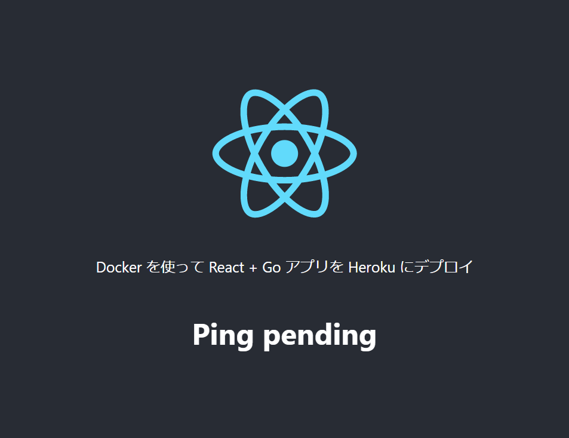

## 構築するもの 

Dockerを使用してHerokuにデプロイできる、React.jsでクライアントを構築し、Goでサーバーを構築します。また、開発するための適切な地域環境もあります。

## Getting started 

個別のクライアントディレクトリとサーバーディレクトリを保持するルートディレクトリを作成します。ルートには、最終製品のビルドに使用されるDockerfile（これはファイルであり、ディレクトリではありません）も保持します。

``` 
project
  |
  |-client/
  |-server/
  |-Dockerfile
```

## Go サーバー

まず最初に、フロントエンドが利用するためのAPIを作成しましょう。/server ディレクトリで新しいGoモジュールを作成し、最初の main.go ファイルを作成します。

環境は Windows 10 でコマンドラインツールは Git Bash を使う想定です。

``` console
cd /c/Users/＜ユーザ名＞/Desktop/
mkdir ./react-go-heroku
cd ./react-go-heroku/
mkdir ./server
cd ./server
```

mod ファイルを作成

``` console
go mod init github.com/＜自分の GitHub のユーザ名＞/react-go-heroku
```

まずは２つのモジュールを import する

``` console
go get github.com/gin-gonic/contrib/static
go get github.com/gin-gonic/gin
```

main.go の内容は以下の通り

``` go
package main

import (
	"github.com/gin-gonic/contrib/static"
	"github.com/gin-gonic/gin"
)

func main() {

	r := gin.Default()

	// この行はまだ気にしない、Dockerise の部分で意味が分かる
	r.Use(static.Serve("/", static.LocalFile("./web", true)))
	
  api := r.Group("/api")
	api.GET("/ping", func(c *gin.Context) {
		c.JSON(200, gin.H{
			"message": "pong",
		})
	})

	r.Run()
}
```

ここでは、ルーティングを支援するために人気のある Web フレームワーの gin を使用しています。

アプリの動作は以下のコマンドで確認する。

``` console
go run main.go

# これは新しい Git Bash で実行する
curl localhost:8080/api/ping
```

## Getting started with React

> 免責事項：ここで生成されたコードは、React および create-react-app 進化に伴って
> 変更される可能性があります。

Facebook の create-react-app ツールを利用すれば
フロントエンドをすばやくスキャフォールディングするので、
プロジェクトのルートディレクトリにジャンプして、次のコマンドを実行します。

``` console
npx create-react-app client
```

> モノリポジトリを作成しているので、新しく作成した /client ディレクトリ
> にある git リポジトリ（.git）を削除してください。

### PingComponent

サーバーにアクセスできるコンポーネントを作成しましょう。
この場合、API 呼び出しを行うのに役立つ一般的なフレームワーク
である axios を使用します。
以下のファイルを React アプリの src ディレクトリに配置し、
このファイルを `PingComponent.js` と呼びます。

このコードを使う前に、axios パッケージをインポートする必要があります。

``` console
# /client ディレクトリから実行する
yarn add axios
```

PingComponent.js のコードは以下の通りです。

``` js
import React, { Component } from 'react'
import axios from 'acios'

class PingComponent extends Component {

    constructor() {
        super()
        this.state = {
            pong: 'pending'
        }
    }

    componentWillMount() {
        axios.get('api/ping')
            .then((response) => {
                this.setState(() => {
                    return { pong: response.data.message }
                })
            })
            .catch(function (error) {
                console.log(error)
            })
    }

    render() {
        return <h1>Ping {this.state.pong}</h1>
    }
}

export default PingComponent
```

13行目で api/ping のエンドポイントを起動していることに注目してください。
yarn start を使って React アプリを起動すると、
これは http://localhost:3000/api/ping に相当します。

### App.js

それでは、可能な限りシンプルな方法で ping コンポーネントを接続してみましょう。
create-react-app ツールで作成した App.js ファイルに、以下を追加します。

``` js
import logo from './logo.svg'
import './App.css'
import PingComponent from './PingComponent'

function App() {
  return (
    <div className="App">
      <header className="App-header">
        
        <p>
          Docker を使って React + Go アプリを Heroku にデプロイ
        </p>
        <PingComponent />

      </header>
    </div>
  );
}

export default App;
```

4行目と23行目に注目してください。ここでは、PingComponent をインポートして使用しています。

### ローカル開発のための Proxy

仮に両方のコードベースを起動すると、クライアントが 3000 番ポートで、
サーバーが 8080 番ポートで動作しています。
これは開発にとって理想的ではありません。

そこで、package.json に proxy フィールドを追加して修正することで、
未知のリクエストをすべて API サーバーにプロキシするように
クライアントを設定することができます。

``` json
"proxy": "http://localhost:8080"
```

## ローカルでの実行

さて、これでサーバーと、リクエストをプロキシする機能を持つクライアントができました。
それでは早速試してみましょう。

ターミナルを開いて、まずサーバーを起動し（まだ起動していなければ）、
次にクライアントを yarn start で起動します。

これで自動的にブラウザでアプリが開かれ、成功が確認できるはずです。



## Docker

これで開発環境が整いましたので、これを「prod」にしてみましょう。

### Dockerfile

まず、本番コードをホストする Docker コンテナを作成します。

これは実行可能な Go プログラムと、React アプリケーションの
プロダクションビルドとなります。
このためには、マルチステージの Docker ビルドを使用することができ、
プロジェクトのルートにある Dockerfile というファイルにこのテキストを貼り付けます。

``` dockerfile
# Go API をビルドする
FROM golang:latest AS builder
ADD . /app
WORKDIR /app/server
RUN go mod download
RUN CGO_ENABLED=0 GOOS=linux GOARCH=amd64 go build -ldflags "-w" -a -o /main .

# React アプリをビルドする
FROM node:alpine AS node_builder
COPY --from=builder /app/client ./
RUN npm install
RUN npm run build

# 最終段階のビルドで、
# これが本番環境にデプロイされるコンテナ
FROM alpine:latest
RUN apk --no-cache add ca-certificates
COPY --from=builder /main ./
COPY --from=node_builder /build ./web
RUN chmod +x ./main
EXPOSE 8080
CMD ./main
```

ここでは、3つの Docker コンテナを作成しています。
1つ目は Go API を構築するため、2つ目は React アプリケーションを
構築するため、そして3つ目は本番コードのみを格納する軽量コンテナを作成しています。

> ここでのちょっとしたコツは、`.dockerignore` ファイルを作成して、
> 不要なファイルを docker コンテキストにプッシュしないようにすることです。
> 今回のケースでは、client/node_modules ファイルが非常に大きなサイズになっています。
> そこで、このファイルを .dockerignore ファイルに追加しましょう。

``` console
echo '**/node_modules' > ./.dockerignore
```

### Dockerコンテナの実行

``` console 
docker build -t golang-heroku .
docker run -p 3000:8080 -d golang-heroku
```

docker build で golang-heroku というタグのついたイメージが作成されるので、
run コマンドでこのイメージのインスタンスを実行することができます。

docker run コマンドは、ローカルの 3000 番ポートを
コンテナ内の 8080 番ポートに転送していることに注意してください。

これで、ローカルで作業内容を確認することができます。

http://localhost:3000 にアクセスして、自分のウェブサイトを見てみましょう。

#### Docker プロセスの確認方法

docker ps コマンドを実行することで、すべてのプロセスのステータスが一覧表示されます。

``` console
docker ps
```

コンテナID のみを表示させたい場合は `-q` オプションを付ける。

``` console
docker ps -q
```

#### Docker プロセスの停止方法

docker stop コマンドを、対象コンテナのコンテナIDを指定して実行することで、対象コンテナを停止させることができます。

``` console
docker stop ＜コンテナID＞
```

起動しているコンテナが１つしかない場合は、コマンドを組み合わせて次のようにコンテナを停止させることもできる。

``` console
docker stop `docker ps -q`
```

#### 停止している Docker プロセスの確認方法

docker ps コマンドに `-a` オプションを付ければ、停止中のプロセスのステータスを一覧表示させることができる。

``` console
docker ps -a
```

コンテナID のみを表示させたい場合は `-q` オプションを付け加える。

``` console
docker ps -aq
```

#### Docker プロセスの削除方法

docker rm コマンドを、対象コンテナのコンテナIDを指定して実行することで、対象コンテナを削除することができる。

``` console
docker rm ＜コンテナID＞
```

#### Docker イメージの表示方法

docker images コマンドを実行することで、保管している Docker イメージのステータスを一覧表示できる。

``` console 
docker images
```

#### Docker イメージの削除方法

docker rmi コマンドを、対象コンテナのコンテナIDを指定して実行することで、対象コンテナのイメージを削除することができる。

``` console
docker rmi ＜コンテナID＞
```

## Heroku

これで、Heroku に提供したいものをローカルでビルドすることができました。

これは簡単なプロセスで、Heroku のリモートにコードをプッシュするたびに、
新しいビルドが開始されます。Heroku が Docker のビルドとデプロイを行います。

あまり詳しい説明はしませんが、すでに Heroku のアカウントを作成し、
CLI ツールをインストールしたと仮定しましょう。

``` console
scoop instal heroku-cli
```

ログインしていることを確認してください。

``` console
heroku login
```

プロジェクトのルートに、heroku.yml というファイルを追加します。
これは、Heroku にアプリケーションのデプロイ方法を伝えるものです。

## Git

まだ作成していない場合は、プロジェクトのルートに git リポジトリを作成したいと思います。
git の混乱を避けるため、client/.git ディレクトリが削除されていることを確認してください。


